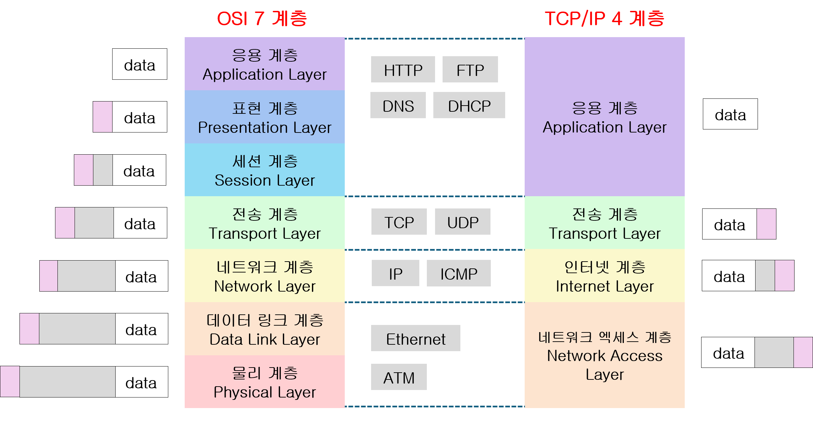
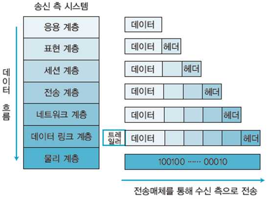

# Day 01 - OSI 7계층 vs TCP/IP 4계층

---

## 메타 정보

| 항목 | 내용 |
|------|------|
| PHASE | 1주차 1일차 |
| 과목 | 네트워크 |
| 키워드 | OSI 7계층, TCP/IP 4계층, 캡슐화, 프로토콜, 계층 모델 |
| 목적 | 면접 대비 + 실무 기본기 |

---

## 1. 왜 계층 모델이 필요한가?

> 네트워크 통신을 역할별로 나눠 **각 계층이 자기 일만 하게** 만든 구조. 유지보수와 표준화를 위해 필수적이다.

- 통신 과정을 하나의 덩어리로 만들면 한 곳이 고장났을 때 전체가 영향을 받음
- 계층으로 나누면 문제 발생 시 **어느 계층의 문제인지** 빠르게 진단 가능
- 제조사나 OS가 달라도 같은 계층끼리는 통신 가능 (표준화)

---

## 2. OSI 7계층



> OSI는 **이론적 표준 모델**. ISO에서 만든 "네트워크 통신을 이렇게 설명하자"는 교육/진단용 프레임워크.

| 계층 번호 | 계층 이름 | 핵심 역할 | 대표 프로토콜/기술 |
|-----------|-----------|-----------|-------------------|
| 7 | 응용 (Application) | 사용자와 직접 맞닿는 인터페이스 | HTTP, FTP, DNS, SMTP |
| 6 | 표현 (Presentation) | 데이터 형식 변환, 암호화/복호화 | SSL/TLS, JPEG, UTF-8 |
| 5 | 세션 (Session) | 연결 세션 수립/유지/종료 | 로그인 세션 |
| 4 | 전송 (Transport) | 신뢰성 있는 데이터 전송, 흐름 제어 | TCP, UDP |
| 3 | 네트워크 (Network) | 경로 선택 (라우팅), 논리 주소 | IP, ICMP |
| 2 | 데이터링크 (Data Link) | 같은 네트워크 내 전송, 물리 주소 | MAC, 이더넷 |
| 1 | 물리 (Physical) | 실제 전기 신호, 케이블 | 케이블, 허브, 리피터 |

**암기 팁:**
```
물 - 데 - 네 - 전 - 세 - 표 - 응
(물리 - 데이터링크 - 네트워크 - 전송 - 세션 - 표현 - 응용)
```

---

## 3. TCP/IP 4계층

> TCP/IP는 **실제 인터넷이 동작하는 구현체**. 미국 국방부에서 만든 실용 모델로 현재 인터넷의 표준.

| 계층 번호 | 계층 이름 | OSI 대응 | 주요 프로토콜 |
|-----------|-----------|----------|---------------|
| 4 | 응용 (Application) | 5 + 6 + 7 | HTTP, FTP, DNS |
| 3 | 전송 (Transport) | 4 | TCP, UDP |
| 2 | 인터넷 (Internet) | 3 | IP, ICMP, ARP |
| 1 | 네트워크 액세스 (Network Access) | 1 + 2 | 이더넷, Wi-Fi |

---

## 4. OSI vs TCP/IP 비교

| 구분 | OSI 7계층 | TCP/IP 4계층 |
|------|-----------|--------------|
| 목적 | 이론적 표준, 교육/진단용 | 실제 인터넷 구현체 |
| 계층 수 | 7개 | 4개 |
| 만든 주체 | ISO (국제표준화기구) | 미국 국방부 (DARPA) |
| 현실 사용 | 문제 진단 프레임워크 | 실제 통신 프로토콜 스택 |
| 세션/표현 계층 | 별도 존재 | 응용 계층에 통합 |

> **핵심 관계:** 실무에서는 TCP/IP로 통신하지만, 장애가 발생했을 때 "몇 계층 문제인지" 진단하는 프레임워크로 OSI를 사용한다. 둘은 경쟁 관계가 아니라 역할이 다른 보완 관계.

---

## 5. 캡슐화 / 역캡슐화 (흐름 파악)



> 데이터를 보낼 때 각 계층을 내려가면서 **헤더를 붙이고**, 받을 때는 올라가면서 **헤더를 벗긴다**.

```
[송신 - 캡슐화]
앱 데이터
→ 전송 계층:          TCP 헤더 + 데이터            → 세그먼트 (Segment)
→ 인터넷 계층:        IP 헤더 + 세그먼트            → 패킷 (Packet)
→ 네트워크 액세스:    MAC 헤더 + 패킷 + 트레일러    → 프레임 (Frame)
→ 물리:               전기 신호로 전송

[수신 - 역캡슐화]
전기 신호 → 프레임 → 패킷 → 세그먼트 → 앱 데이터
(반대 방향으로 헤더를 하나씩 벗겨냄)
```

> **트레일러**는 네트워크 액세스 계층에서만 붙는다. 오류 검출용 데이터(FCS)로, 헤더는 앞에, 트레일러는 뒤에 붙는다.

---

## 6. 각 계층의 데이터 단위

| 계층 | 데이터 단위 |
|------|-------------|
| 전송 계층 | 세그먼트 (Segment) |
| 네트워크 / 인터넷 계층 | 패킷 (Packet) |
| 데이터링크 / 네트워크 액세스 계층 | 프레임 (Frame) |
| 물리 계층 | 비트 (Bit) |

---

## 7. 면접 빈출 질문 & 답변 포인트

**Q. OSI 7계층을 설명해보세요.**
> 1~7계층 이름을 순서대로 말하고, 각 계층의 한 줄 역할을 설명한다.

**Q. OSI 7계층과 TCP/IP 4계층의 차이는?**
> OSI는 이론 표준(진단 프레임워크), TCP/IP는 실제 구현체. 실무에서는 TCP/IP로 동작하지만 장애 진단 시 OSI 계층으로 범위를 좁힌다.

**Q. HTTP는 몇 계층 프로토콜인가요?**
> OSI 기준 7계층(응용 계층), TCP/IP 기준 4계층(응용 계층).

**Q. 캡슐화란?**
> 송신 시 각 계층을 내려가면서 헤더를 추가하는 과정. 수신 시 반대로 헤더를 제거하는 것을 역캡슐화라 한다.

---

## 8. 실무 맥락

- 백엔드 개발자가 HTTP 요청을 다룰 때는 주로 **7계층(응용)**을 다루지만, 네트워크 장애 시 "DNS 문제인가(7계층)? IP 라우팅 문제인가(3계층)? 케이블 문제인가(1계층)?" 처럼 OSI로 진단 범위를 좁힌다.
- 포트 번호는 **4계층(전송)** 개념, IP 주소는 **3계층(네트워크)** 개념임을 알면 방화벽 설정이나 로드밸런서 이해가 쉬워진다.

---

*다음 학습: 5일차 - 캡슐화 / 역캡슐화 (오늘 흐름만 본 것을 더 깊이 파고든다)*