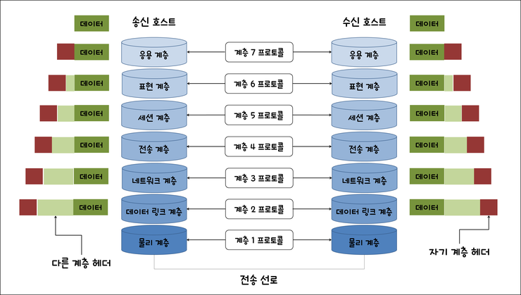

# OSI 7계층 vs TCP/IP 4계층

---

## 1. 왜 계층 모델이 필요한가?

> 컴퓨터 간 데이터를 주고받는 과정을 역할별로 나눠, 각 계층이 자기 일만 하게 만든 구조.

네트워크 통신은 단순히 다른 기기와 주고받는 것만이 아니다. 같은 기기 안에서도 (localhost), 같은 네트워크 안에서도 모두 해당된다. 이 복잡한 통신 과정을 하나의 덩어리로 만들면 문제가 생긴다.

**계층 없이 하나의 덩어리로 만들면**
- 한 곳이 고장나면 전체가 영향받음
- 5G 같은 새 기술이 나오면 HTTP, TCP까지 전부 뜯어고쳐야 함

**계층으로 나누면**
- 물리 계층만 5G로 바꿔도 HTTP, TCP는 그대로 유지됨
- 문제 발생 시 "몇 계층 문제인가"로 범위를 즉시 좁힐 수 있음

**표준화 측면**
- 프로토콜은 표준화를 위해 만든 공통 규칙
- 삼성 갤럭시와 애플 아이폰이 제조사가 달라도 TCP/IP라는 같은 프로토콜을 사용하기 때문에 통신이 가능함
- 계층별로 프로토콜이 표준화되어 있어, 같은 계층끼리는 누가 만들었든 통신 가능

---

## 2. OSI 7계층



> OSI는 이론적 표준 모델. ISO에서 만든 "네트워크 통신을 이렇게 설명하자"는 교육/진단용 틀(프레임워크).

실제 데이터 흐름은 송신 시 위→아래, 수신 시 아래→위로 이동한다. 단, 각 계층은 상대방의 같은 계층과 같은 프로토콜로 약속된 처리를 한다. 이를 논리적 통신이라고 한다.

| 계층 번호 | 계층 이름 | 핵심 역할 | 대표 프로토콜/기술 |
|-----------|-----------|-----------|-------------------|
| 7 | 응용 (Application) | 응용 프로그램이 네트워크를 통해 데이터를 주고받기 위한 규칙 | HTTP, FTP, DNS, SMTP |
| 6 | 표현 (Presentation) | 데이터를 상대방이 읽을 수 있는 형태로 변환, 암호화 | SSL/TLS, JPEG, UTF-8 |
| 5 | 세션 (Session) | 대화의 시작과 끝 관리 (연결 수립/유지/종료) | 로그인 세션 |
| 4 | 전송 (Transport) | 데이터를 신뢰성 있게 전달, 포트 번호로 앱 구분 | TCP, UDP |
| 3 | 네트워크 (Network) | 목적지까지의 경로 선택, IP 주소로 기기 식별 | IP, ICMP |
| 2 | 데이터링크 (Data Link) | 같은 네트워크 안에서 정확한 기기로 전달, MAC 주소 사용 | MAC, 이더넷 |
| 1 | 물리 (Physical) | 데이터를 전기 신호로 변환해서 케이블로 전송 | 케이블, 허브, 리피터 |

**암기 팁:**
```
물 - 데 - 네 - 전 - 세 - 표 - 응
(물리 - 데이터링크 - 네트워크 - 전송 - 세션 - 표현 - 응용)
```
 
---

## 3. 계층별 상세 설명

### 7계층 - 응용 계층 (Application)

응용 프로그램(앱, 웹)이 네트워크를 통해 데이터를 주고받기 위해 정의된 규칙들의 모음이다. 사용자가 실제로 사용하는 서비스가 네트워크에 데이터를 던지는 시작점이다.

- HTTP : 브라우저가 웹 서버에 페이지를 요청하고 응답받는 규칙. 백엔드 개발자가 가장 많이 다루는 프로토콜
- FTP : 파일 전송 전용 프로토콜. 현재는 HTTP로 대체되는 추세
- DNS : 사람이 읽기 편한 도메인(google.com)을 컴퓨터가 찾아갈 수 있는 IP 주소로 변환하는 규칙
- SMTP : 이메일 전송 프로토콜
### 6계층 - 표현 계층 (Presentation)

송신측에서 데이터를 포장하고, 수신측에서 상대방이 읽을 수 있는 형태로 변환해주는 계층이다.

- SSL/TLS : 데이터를 암호화해서 주고받기 위한 프로토콜. 브라우저 주소창의 `https://`에서 s가 SSL/TLS 암호화가 적용됐다는 의미
- JPEG, PNG : 이미지 데이터 형식 변환
- UTF-8 : 텍스트 인코딩 방식. 한글 깨짐 현상이 인코딩 방식이 맞지 않아서 생기는 문제
### 5계층 - 세션 계층 (Session)

두 컴퓨터가 대화를 시작하고, 유지하고, 끝내는 것을 관리하는 계층이다. 전화 통화에 비유하면 전화 걸기(수립), 통화 중(유지), 전화 끊기(종료)와 같다.

- 로그인 세션 : 로그인 후 페이지를 이동해도 로그인 상태가 유지되는 것이 세션 덕분. 세션이 없으면 페이지 이동할 때마다 로그인해야 함
### 4계층 - 전송 계층 (Transport)

> 위 3개 계층(응용, 표현, 세션)이 "뭘 보낼지" 준비했다면, 전송 계층부터는 "어떻게 실제로 전달할지"를 담당하기 시작한다.

데이터를 잘게 쪼개서(세그먼트) 보내고, 포트 번호로 어느 앱에 전달할지 결정한다.

- TCP : 신뢰성이 최우선일 때 사용. 데이터 도착 확인, 순서 재정렬, 유실 시 재전송. 속도가 상대적으로 느림. 웹 페이지, 파일 전송, 이메일에 사용
- UDP : 속도가 최우선일 때 사용. 도착 여부 확인 없이 그냥 전송. 유튜브 스트리밍, 게임, 화상통화에 사용. 유튜브 영상이 잠깐 깨지는 것이 UDP 특성
```
포트 번호 예시:
HTTP  → 80번 포트
HTTPS → 443번 포트
```

### 3계층 - 네트워크 계층 (Network)

데이터가 목적지까지 어떤 경로로 찾아갈지 결정하는 계층이다. 이 역할을 하는 장비가 라우터다.

- IP : 데이터에 출발지/목적지 IP 주소를 붙여서 보내는 규칙. IP 주소는 논리 주소로 바뀔 수 있음 (집 주소처럼 이사하면 바뀜)
- ICMP : 네트워크 상태를 확인하는 프로토콜. `ping google.com` 명령어가 ICMP를 사용
```
IP 주소  → 논리 주소, 바뀔 수 있음 (집 주소)
MAC 주소 → 물리 주소, 하드웨어에 고정 (주민등록번호)
```

### 2계층 - 데이터링크 계층 (Data Link)

같은 네트워크 안에 있는 기기끼리 데이터를 전달하는 계층이다.

```
네트워크 계층   → 서울에서 부산까지 전체 경로
데이터링크 계층 → 서울 안 우리 동네 골목길 이동
```

- MAC : 네트워크 카드에 제조사가 새겨놓은 고유 번호. 하드웨어에 고정
- 이더넷 : 유선으로 연결된 기기끼리 통신하는 규칙 (랜선)
- Wi-Fi : 무선으로 연결된 기기끼리 통신하는 규칙. 이더넷의 무선 버전
### 1계층 - 물리 계층 (Physical)

모든 디지털 데이터를 0과 1의 전기 신호로 변환해서 케이블로 내보내는 계층이다. 랜선이 빠지면 인터넷이 안 되는 것이 1계층 문제다.

- 케이블 : 전기 신호를 전달하는 통로 (랜선, 광케이블)
- 허브 : 연결된 모든 기기에 신호를 전송하는 장비. 현재는 스위치로 대체
- 리피터 : 약해진 전기 신호를 증폭시켜주는 장비


---

## 4. TCP/IP 4계층

> TCP/IP는 OSI 7계층이라는 이론을 보고 실제로 OS에 소프트웨어로 구현한 것. 구현하다 보니 합쳐도 되는 계층은 합쳐서 4개가 됐다. 사실 TCP/IP가 OSI보다 먼저 만들어졌고, 나중에 ISO가 이를 이론적으로 정리한 것이 OSI다.

| 계층 번호 | 계층 이름 | OSI 대응 | 주요 프로토콜 |
|-----------|-----------|----------|---------------|
| 4 | 응용 (Application) | OSI 5 + 6 + 7 | HTTP, FTP, DNS |
| 3 | 전송 (Transport) | OSI 4 | TCP, UDP |
| 2 | 인터넷 (Internet) | OSI 3 | IP, ICMP |
| 1 | 네트워크 액세스 (Network Access) | OSI 1 + 2 | 이더넷, Wi-Fi |

### 계층별 역할

**1계층 - 네트워크 액세스 (OSI 1+2 통합)**
물리적으로 데이터를 전송하는 모든 것을 담당한다. 전기 신호 변환과 같은 네트워크 안 기기 식별이 어차피 물리적 전송에 관한 얘기라 묶었다.
- 랜선/Wi-Fi로 데이터 전송
- MAC 주소로 같은 네트워크 안 기기 식별
- 전기 신호로 변환

**2계층 - 인터넷 (OSI 3 그대로)**
IP 주소 기반으로 전 세계 인터넷에서 목적지까지 경로를 찾아가는 것을 담당한다.
- IP 주소로 목적지 지정
- 라우터가 최적 경로 선택
- 여러 라우터를 거쳐서 목적지 도착

**3계층 - 전송 (OSI 4 그대로)**
데이터를 얼마나 신뢰성 있게 전달하냐를 담당한다.
- TCP → 신뢰성 우선 (웹, 파일, 이메일)
- UDP → 속도 우선 (스트리밍, 게임)

**4계층 - 응용 (OSI 5+6+7 통합)**
실제 서비스/앱이 데이터를 주고받는 것을 담당한다. 세션, 표현, 응용이 결국 "앱이 데이터를 어떻게 다루냐"에 관한 얘기라 묶었다.
- HTTP로 웹 페이지 요청/응답
- DNS로 도메인 → IP 변환
- SSL/TLS로 데이터 암호화
- 세션 유지 (로그인 상태)

> 위로 갈수록 "뭘 보낼지", 아래로 갈수록 "어떻게 물리적으로 전달할지"에 가까워진다.

---

## 4. OSI vs TCP/IP 비교

| 구분 | OSI 7계층 | TCP/IP 4계층 |
|------|-----------|--------------|
| 목적 | 이론적 표준, 교육/진단용 | 실제 인터넷 구현체 |
| 계층 수 | 7개 | 4개 |
| 만든 주체 | ISO (국제표준화기구) | 미국 국방부 (DARPA) |
| 현실 사용 | 문제 진단 프레임워크 | 실제 통신 프로토콜 스택 |
| 세션/표현 계층 | 별도 존재 | 응용 계층에 통합 |

> **핵심 관계:** 실무에서는 TCP/IP로 통신하지만, 장애가 발생했을 때 "몇 계층 문제인지" 진단하는 프레임워크로 OSI를 사용한다. 둘은 경쟁 관계가 아니라 역할이 다른 보완 관계.

---

## 5. 캡슐화 / 역캡슐화 (흐름 파악)


> 데이터를 보낼 때 각 계층을 내려가면서 **헤더를 붙이고**, 받을 때는 올라가면서 **헤더를 벗긴다**.

```
[송신 - 캡슐화]
앱 데이터
→ 전송 계층:          TCP 헤더 + 데이터            → 세그먼트 (Segment)
→ 인터넷 계층:        IP 헤더 + 세그먼트            → 패킷 (Packet)
→ 네트워크 액세스:    MAC 헤더 + 패킷 + 트레일러    → 프레임 (Frame)
→ 물리:               전기 신호로 전송

[수신 - 역캡슐화]
전기 신호 → 프레임 → 패킷 → 세그먼트 → 앱 데이터
(반대 방향으로 헤더를 하나씩 벗겨냄)
```

> **트레일러**는 네트워크 액세스 계층에서만 붙는다. 오류 검출용 데이터(FCS)로, 헤더는 앞에, 트레일러는 뒤에 붙는다.

---

## 6. 각 계층의 데이터 단위

| 계층 | 데이터 단위 |
|------|-------------|
| 전송 계층 | 세그먼트 (Segment) |
| 네트워크 / 인터넷 계층 | 패킷 (Packet) |
| 데이터링크 / 네트워크 액세스 계층 | 프레임 (Frame) |
| 물리 계층 | 비트 (Bit) |

---

## 7. 면접 빈출 질문 & 답변 포인트

**Q. OSI 7계층을 설명해보세요.**
> 1~7계층 이름을 순서대로 말하고, 각 계층의 한 줄 역할을 설명한다.

**Q. OSI 7계층과 TCP/IP 4계층의 차이는?**
> OSI는 이론 표준(진단 프레임워크), TCP/IP는 실제 구현체. 실무에서는 TCP/IP로 동작하지만 장애 진단 시 OSI 계층으로 범위를 좁힌다.

**Q. HTTP는 몇 계층 프로토콜인가요?**
> OSI 기준 7계층(응용 계층), TCP/IP 기준 4계층(응용 계층).

**Q. 캡슐화란?**
> 송신 시 각 계층을 내려가면서 헤더를 추가하는 과정. 수신 시 반대로 헤더를 제거하는 것을 역캡슐화라 한다.

---

## 8. 실무 맥락

- 백엔드 개발자가 HTTP 요청을 다룰 때는 주로 **7계층(응용)**을 다루지만, 네트워크 장애 시 "DNS 문제인가(7계층)? IP 라우팅 문제인가(3계층)? 케이블 문제인가(1계층)?" 처럼 OSI로 진단 범위를 좁힌다.
- 포트 번호는 **4계층(전송)** 개념, IP 주소는 **3계층(네트워크)** 개념임을 알면 방화벽 설정이나 로드밸런서 이해가 쉬워진다.

---