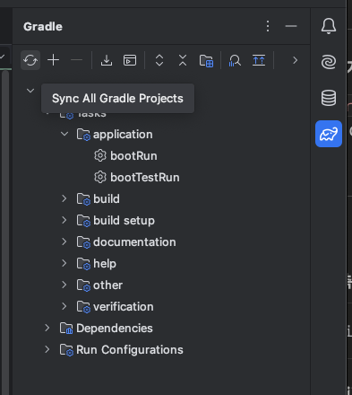

# IntelliJ Gradle 프로젝트 재인식

> PHASE 1 | 개발 환경 & 도구  
> 키워드: `Gradle`, `IntelliJ`, `프로젝트 재인식`, `Re-import`, `Reload`

---

## 언제 이 문제가 생기는가?

- `build.gradle`에 의존성을 추가했는데 코드에서 import가 안 될 때
- 외부에서 프로젝트를 clone했는데 Gradle 프로젝트로 인식이 안 될 때
- IntelliJ가 Gradle 변경사항을 자동으로 반영하지 못했을 때

---

## 왜 생기는가?

`build.gradle`을 수정해도 IntelliJ가 자동으로 반영하지 않는 경우가 있다.  
IntelliJ는 Gradle 파일 변경을 감지해서 다시 읽어야 의존성과 프로젝트 구조를 업데이트한다.

---

## 해결 방법

### 방법 1. 우측 Gradle 패널에서 새로고침 (가장 자주 씀)

```
IntelliJ 우측 → Gradle 탭 → 새로고침 버튼 (↺) 클릭
```



### 방법 2. build.gradle 우클릭

```
build.gradle 파일 우클릭 → "Link Gradle Project" 또는 "Reload Gradle Project"
```

### 방법 3. 메뉴에서 직접 실행

```
File → Reload All from Disk
```

---

> 의존성 추가 후 import가 안 된다면 **방법 1**부터 시도하면 대부분 해결된다.